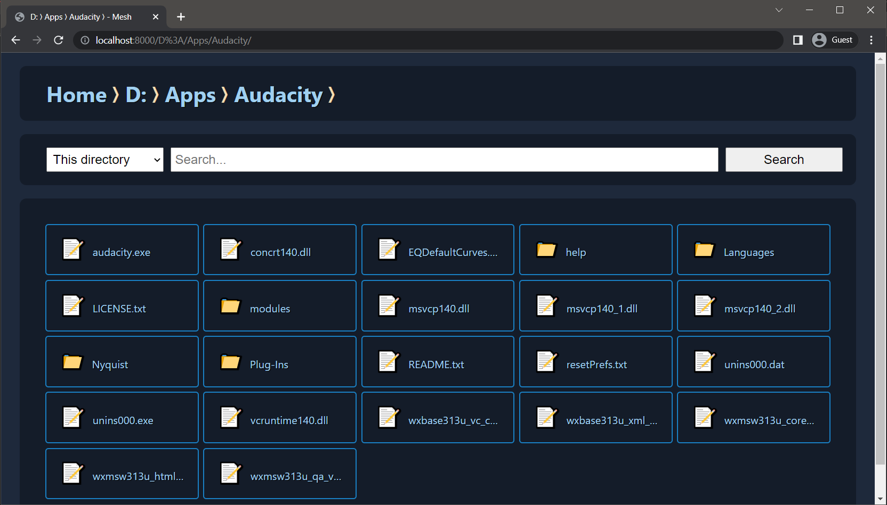

# Mesh

Windows Explorer, but inside browser, with same program trigerring capabilities.

Basically, if Windows Explorer haven't evolved yet to have browser-like tabs - you put files and folders *in* browser instead.

## Features

1. Browse multiple Windows drives
2. Files can be opened directly from browser in their native program, just click

## To-do

1. [x] (For windows) Main page should display all drives
2. [ ] Tidy up navigation page template
3. [ ] (See **Disclaimer**) Is it possible to verify origin of click while running programs?
4. [x] Search in current directory
5. [ ] Search in other directories
6. [ ] Linux based directory structure support

## Disclaimer

For some very good reasons, your average web apps aren't allowed (or limited) to interact with your system outside of browser. This tool overcomes said limitation by utilizing custom written Python server to launch the program instead.

This feature, while useful in a way, can be used to run a file that resides in your system with just a click of a link. That being said, this file mentioned here can be a malware which you don't know resides in your system. Its adviced you click Mesh's links only inside the app itself, while avoiding anything from external sources.